# PRISMA

**Um caderno pessoal de referências visuais, onde cada coisa leva a várias dimensões.**

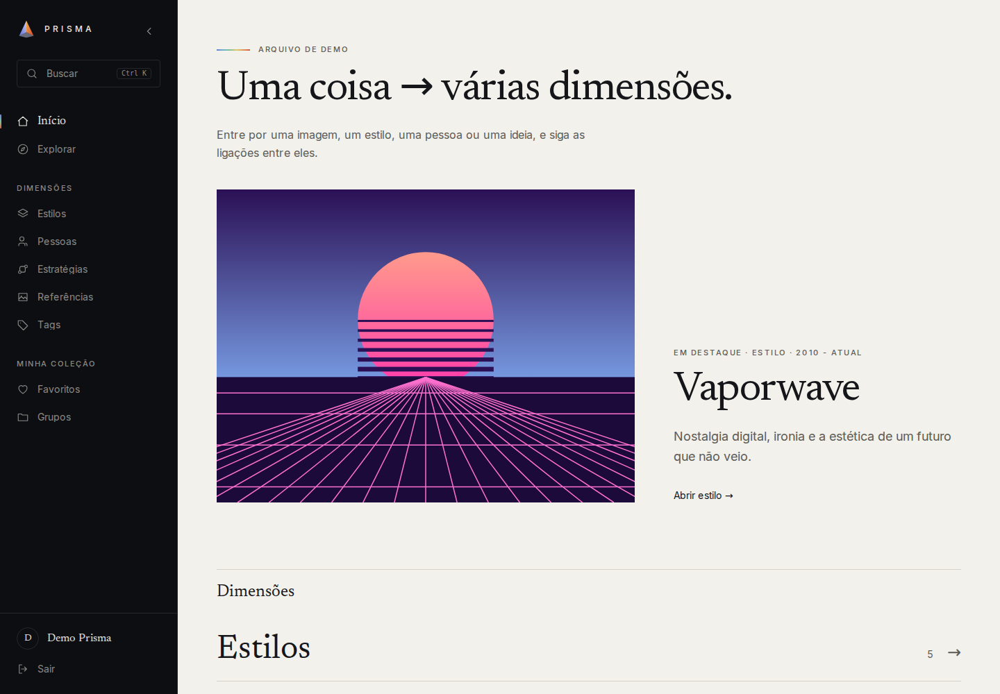

[](backend/composer.json)
[](frontend/package.json)
[](frontend/package.json)
[](frontend/package.json)
[](backend/docker-compose.yml)

O PRISMA reúne, em um só lugar, **estilos**, **pessoas**, **estratégias** e **referências em imagem** que a pessoa quer estudar sobre arte e design. Em vez de pastas e listas soltas, os conteúdos se ligam entre si: um estilo leva às pessoas que o moldaram, às imagens que o ilustram e às ideias por trás dele, e o caminho inverso também funciona.

Cada conta é um acervo privado. Ninguém vê os dados de outra pessoa.

## Sumário

- [Visão geral](#visão-geral)
- [Demonstração visual](#demonstração-visual)
- [Funcionalidades](#funcionalidades)
- [Tecnologias](#tecnologias)
- [Arquitetura e organização](#arquitetura-e-organização)
- [Executando localmente](#executando-localmente)
- [Testes e verificações](#testes-e-verificações)
- [Documentação](#documentação)
- [Estado atual e limitações](#estado-atual-e-limitações)
- [Licença e contribuição](#licença-e-contribuição)

## Visão geral

Quem estuda design e arte costuma guardar referências em lugares diferentes: imagens numa pasta, anotações em outro app, links em favoritos. O que se perde é a **relação** entre as coisas: de onde veio aquela imagem, a que movimento ela pertence, quem a fez, que princípio ela ilustra.

O PRISMA organiza essas relações a partir de quatro tipos de conteúdo:

| Conteúdo | Para que serve |
| --- | --- |
| **Estilos** | Movimentos e estéticas, com história, características, influências, período e origem. |
| **Pessoas** | Designers, artistas e pensadores, ligados aos estilos em que atuaram. |
| **Estratégias** | Princípios, práticas e metodologias, ligados aos estilos em que se aplicam. |
| **Referências** | Imagens (arquivo ou URL) com título, descrição, crédito, fonte e tags, que podem pertencer a vários estilos, pessoas e estratégias ao mesmo tempo. |

A ideia central, **"uma coisa → várias dimensões"**, aparece na navegação: a página de um estilo mostra suas pessoas, estratégias e referências; a página de uma referência mostra de onde ela faz parte e sugere outras do mesmo contexto. Tags e coleções (favoritos e grupos) atravessam todos os tipos.

É um projeto pessoal em desenvolvimento, pensado para uso individual.

## Demonstração visual

As imagens abaixo são capturas reais da aplicação em execução, com os dados de demonstração do seed (arte original em SVG criada para o projeto).

### Entrada

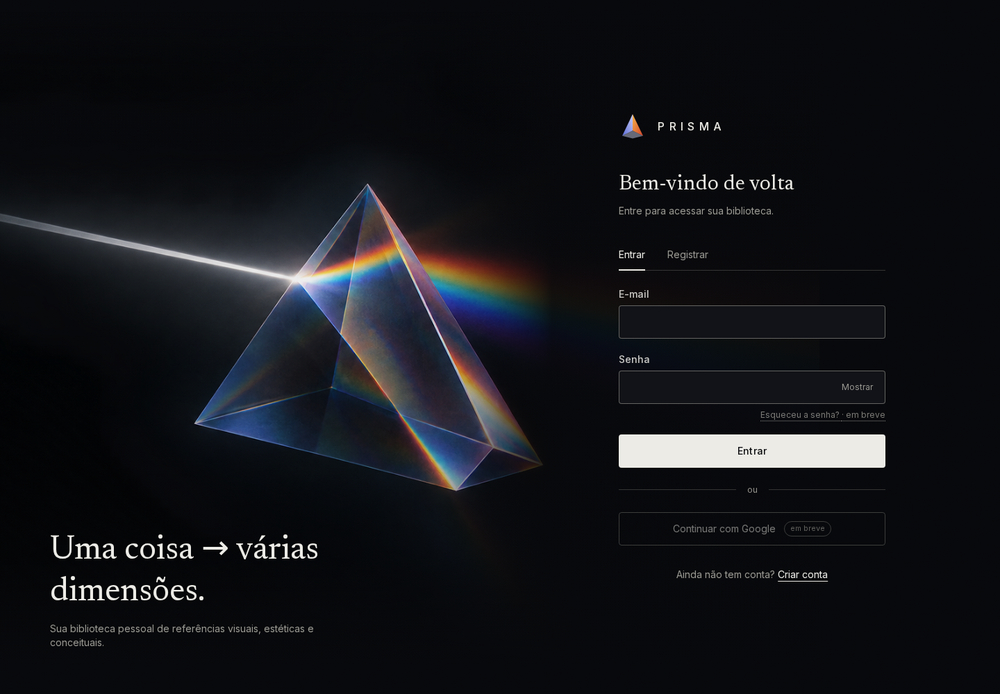

Login e cadastro em uma composição única, sobre uma ilustração de um prisma decompondo a luz. Recuperação de senha e login com Google aparecem como "em breve" e ainda não estão implementados.

### Um estilo e suas dimensões

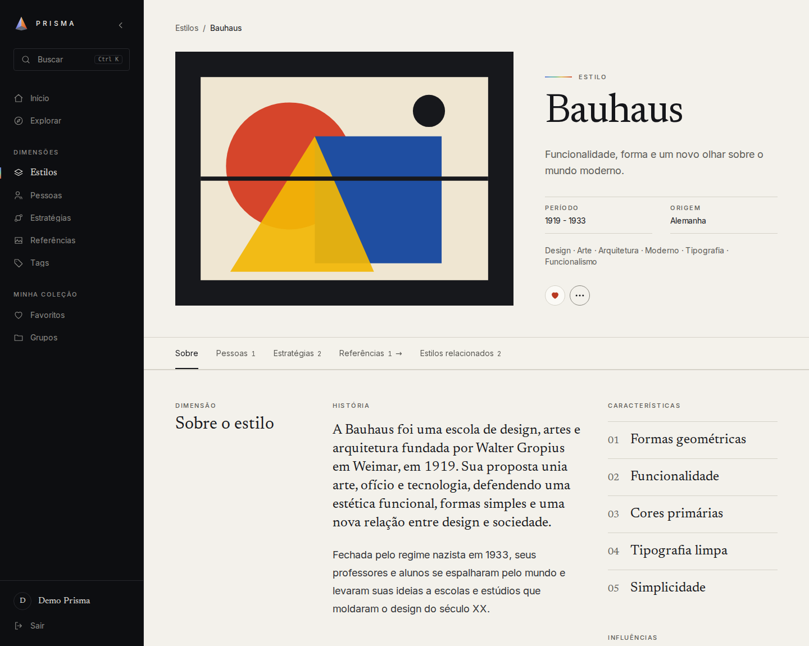

A página de um estilo reúne o conteúdo editorial (história, características numeradas e influências) em "Sobre o estilo". O índice fixo leva às pessoas, estratégias, referências e estilos relacionados. Dimensões que crescem, como as referências, abrem uma página própria só com as imagens.

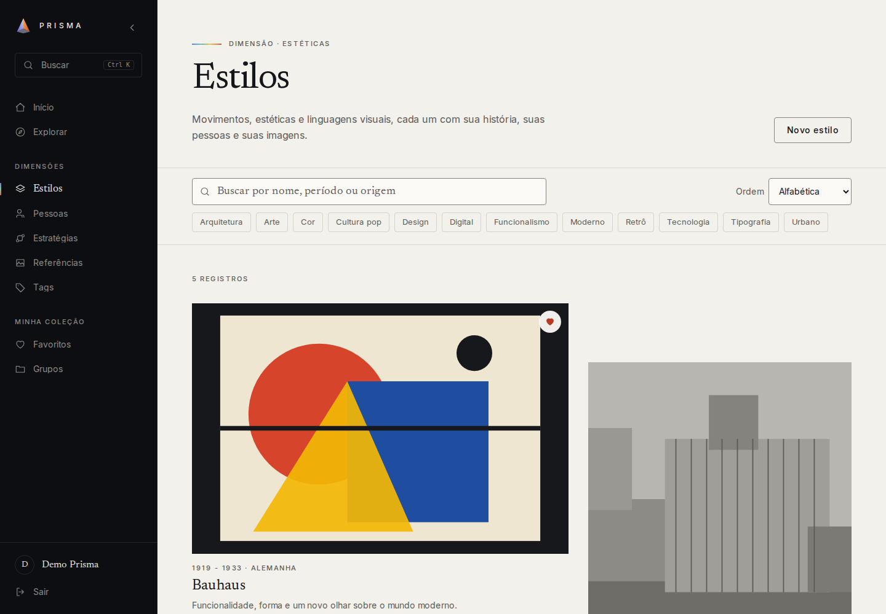

A lista de estilos usa uma composição com ritmo, em vez de uma grade uniforme de cartões. No topo ficam a busca, a ordenação e as tags. Estratégias, por sua vez, formam um índice tipográfico:

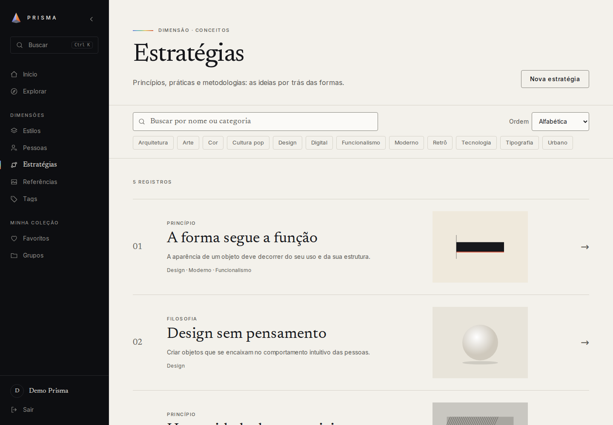

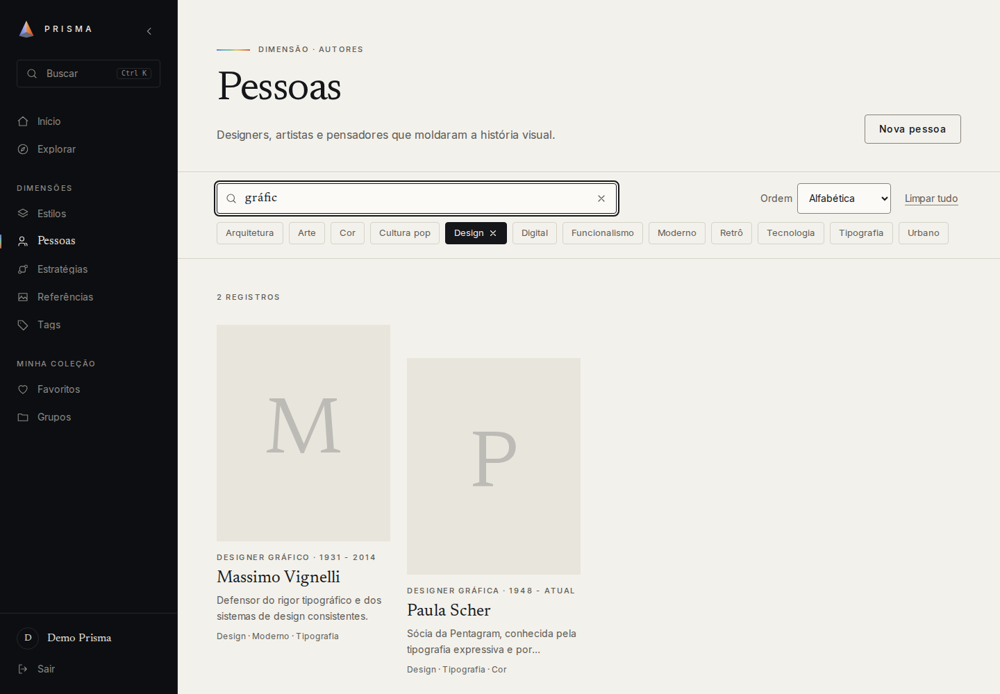

Nas listas, a busca atualiza sozinha enquanto se digita, sem Enter nem botão, e combina com as tags (botões alternáveis). O "×" do campo limpa só o texto; "Limpar tudo" remove busca e tags.

### A biblioteca de referências

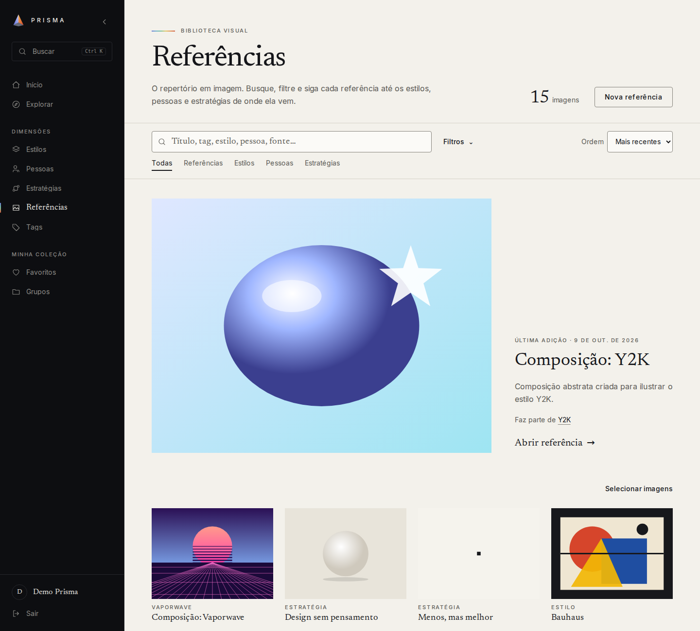

A biblioteca trata a imagem como protagonista: a última adição aparece em destaque e as demais em mosaico, com legenda de uma linha. A busca é ao vivo e cobre título, descrição, crédito, fonte, tags e os nomes dos estilos, pessoas e estratégias vinculados. O painel de filtros combina estilo, pessoa, estratégia, tag e coleção, com ordenação e chips dos filtros ativos.

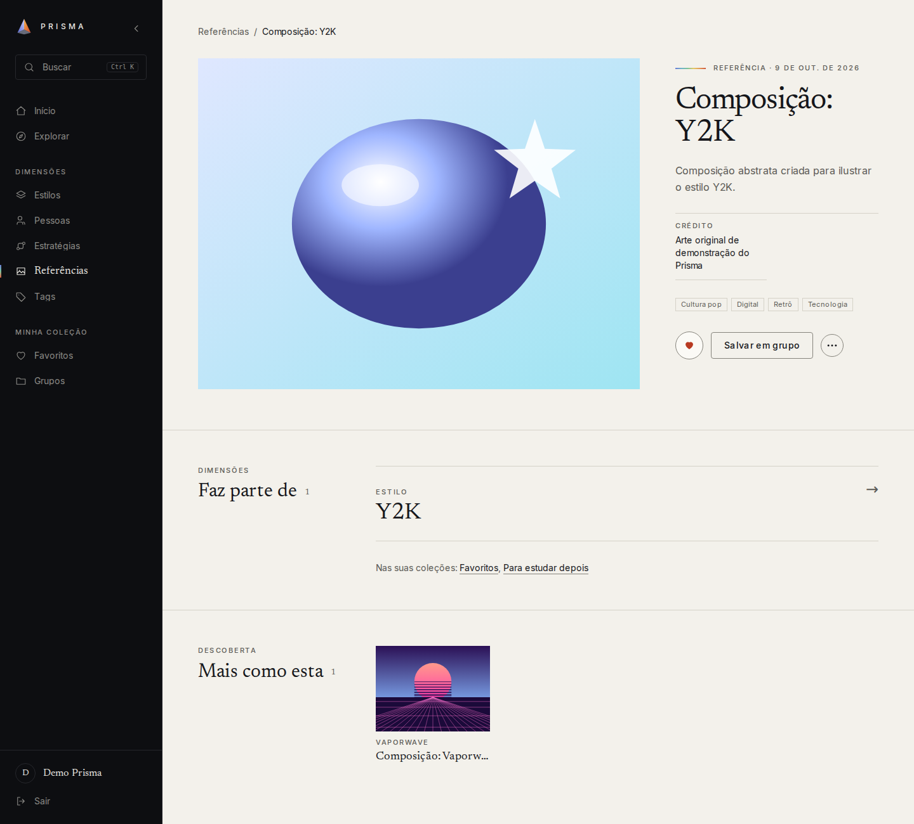

Cada referência tem sua página: imagem, descrição, crédito, tags, **"Faz parte de"** (os estilos, pessoas e estratégias a que está ligada) e **"Mais como esta"**, com imagens que compartilham algum vínculo ou tag.

### Busca global e coleções

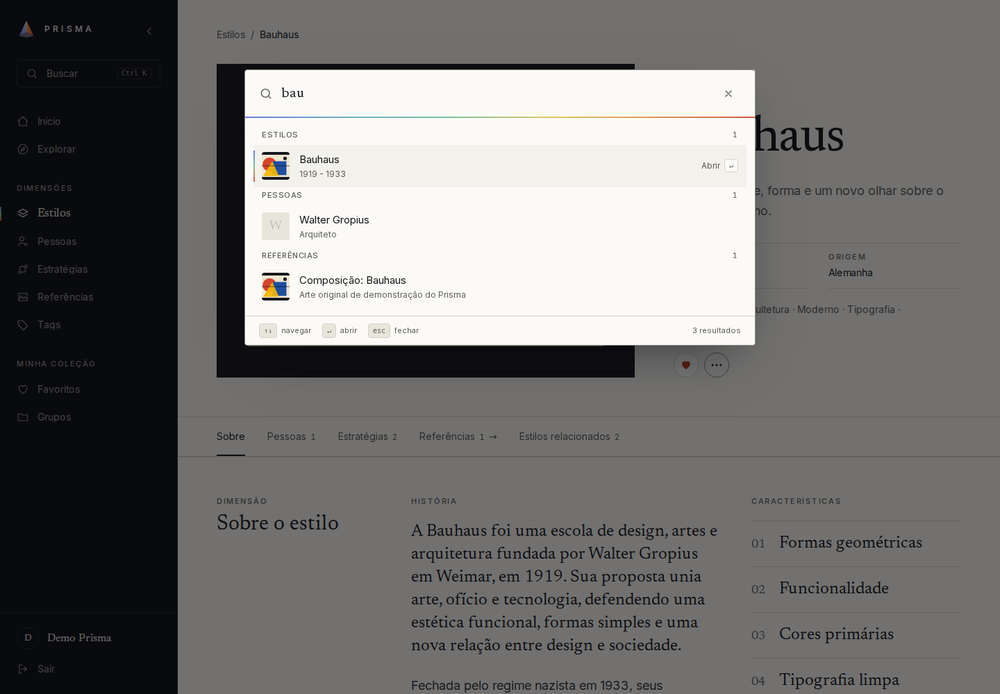

`Ctrl + K` (ou `Cmd + K`) abre a pesquisa global: resultados agrupados por tipo, com contagem e miniaturas, o item selecionado indicado por "Abrir ↵", comandos de navegação e criação e controle total pelo teclado. Ela também mostra estados de carregamento, sem resultado e erro com nova tentativa.

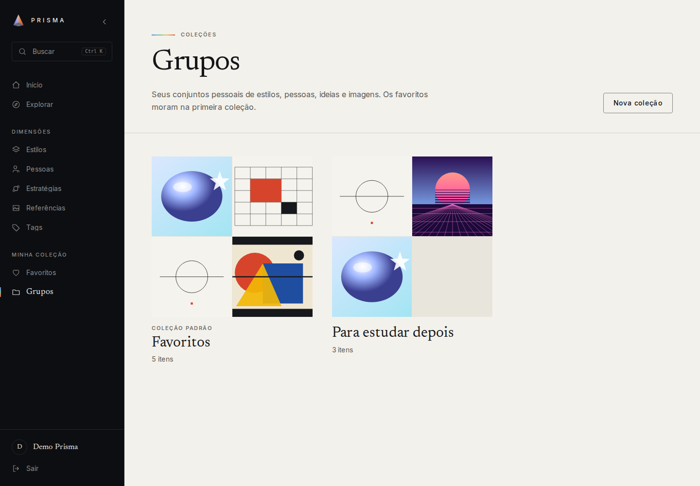

Favoritos e grupos organizam o acervo pessoal. Qualquer conteúdo (estilo, pessoa, estratégia ou referência) pode estar em vários grupos.

### No celular

<table>
  <tr>
    <td width="50%">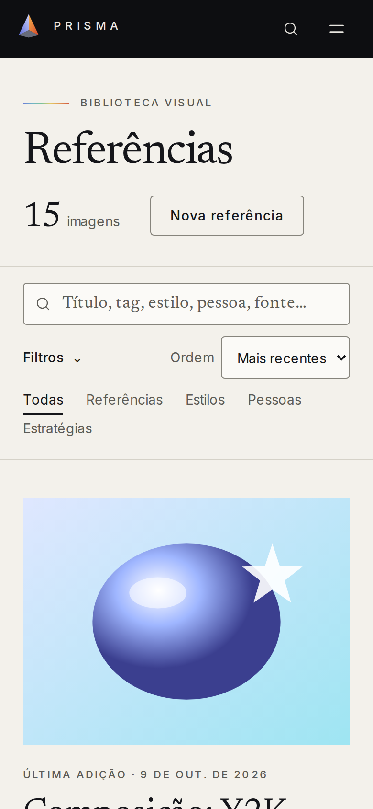</td>
    <td width="50%">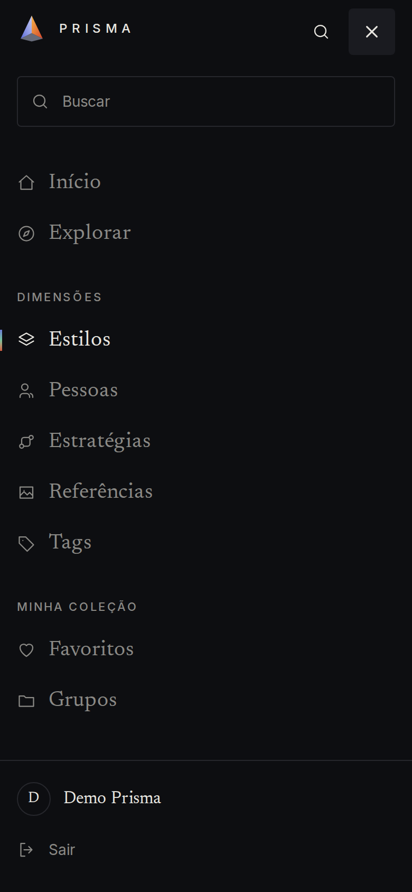</td>
  </tr>
</table>

No celular, a biblioteca usa duas colunas, os filtros ficam recolhidos num painel e o menu vira um índice em tela cheia, com foco gerenciado e alvos de toque amplos.

## Funcionalidades

Tudo o que está listado aqui existe no código; a maior parte é coberta por testes automatizados.

**Acervo**

- Cadastro, edição e exclusão de estilos, pessoas e estratégias, com imagem enviada por arquivo ou por URL.
- Relações entre conteúdos: pessoas e estratégias se ligam a estilos; estilos mostram sugestões de estilos relacionados a partir das tags em comum.
- Páginas de detalhe contínuas, com índice fixo, e portais com prévia para o que cresce (pessoas, estratégias e referências).

**Referências e biblioteca visual**

- Envio de imagem (até 5 MB) ou URL, com título, descrição, crédito, fonte e **tags próprias**.
- Uma imagem pode se ligar a vários estilos, pessoas e estratégias, individualmente ou **em lote** (seleção de várias imagens).
- Biblioteca com busca ao vivo, filtros, ordenação, "última adição", lightbox com navegação por setas e página própria por referência.
- Favoritar e salvar em grupo diretamente a partir de cada imagem.

**Descoberta**

- **Explorar:** tudo o que está na conta, em seções por tipo.
- **Pesquisa global** (`Ctrl/Cmd + K`) em estilos, pessoas, estratégias, referências, tags e grupos.
- Listas filtradas por contexto (por exemplo, "pessoas deste estilo").

**Organização pessoal**

- **Tags controladas:** só nascem na tela de tags, nunca de um texto digitado em outro formulário; únicas por conta.
- **Favoritos** (coleção padrão) e **grupos** próprios.

**Conta e privacidade**

- Cadastro e login. Cada conta enxerga e altera **somente os próprios dados**; o isolamento é aplicado no backend.
- Sessão de 1 dia, renovada pelo uso (sem requisições constantes ao backend).

**Interface**

- Direção visual editorial própria: tipografia serifada, composição por tipo de conteúdo e componentes sem biblioteca visual.
- Menu lateral que pode ser minimizado (a escolha é lembrada) e menu em tela cheia no celular.
- Movimento discreto, que respeita `prefers-reduced-motion`.
- Acessibilidade verificada automaticamente com axe (WCAG 2.0/2.1 A e AA) nas principais telas autenticadas e nas camadas abertas (paleta, modais e lightbox).

## Tecnologias

| Camada | Tecnologias |
| --- | --- |
| **Backend** | PHP 8.3, Laravel 13, Laravel Sanctum, Eloquent, MySQL 8 |
| **Frontend** | Next.js 16 (App Router, Server Components e Server Actions), React 19, TypeScript, Tailwind CSS 4, fontes Inter e Newsreader (`next/font`) |
| **Qualidade** | PHPUnit (SQLite em memória), Laravel Pint, ESLint, Playwright e `@axe-core/playwright` |
| **Ambiente** | Docker via [Kool](https://kool.dev) para o backend e o MySQL; Yarn para o frontend |

## Arquitetura e organização

O navegador conversa apenas com o Next.js. É o servidor do Next que chama a API Laravel, com o token de autenticação guardado em cookie `httpOnly` (o JavaScript do navegador nunca o lê). Autorização e validação são aplicadas no backend.

```text
Navegador ──▶ Next.js (Server Components, Server Actions, route handlers) ──▶ API Laravel ──▶ MySQL
                  └─ cookie httpOnly com o token                                └─ storage de imagens
```

```text
.
├── backend/            API Laravel (REST, Sanctum), migrations, seeders e testes
│   ├── app/            Controllers, Models, Policies, Requests e Resources
│   ├── database/       Uma migration por tabela e os seeders de demonstração
│   ├── routes/api.php  Rotas organizadas por prefixo
│   └── tests/Feature/  Testes de feature (PHPUnit)
├── frontend/           Aplicação Next.js
│   ├── app/            Rotas (App Router), Server Actions e route handlers
│   ├── components/     Componentes por área (layout, content, references, ui…)
│   ├── lib/            Acesso à API, sessão, navegação e mapeadores
│   ├── e2e/            Testes ponta a ponta (Playwright)
│   └── scripts/        Geração das capturas de tela do README
└── docs/
    ├── decisions/      Como cada parte funciona e por que (índice, áreas e ADRs)
    ├── screenshots/    Capturas usadas neste README
    └── IDEIA.md        A intenção original do produto
```

As escolhas de maior impacto estão registradas como ADRs em [`docs/decisions/adr/`](docs/decisions/adr/README.md): autenticação por token em cookie, imagens, favoritos como grupo, relação polimórfica das referências, isolamento por conta, sessão renovável, entre outras.

## Executando localmente

### Pré-requisitos

- [Docker](https://docs.docker.com/get-docker/) e [Kool](https://kool.dev/docs/getting-started/installation). PHP e Composer rodam dentro dos containers.
- Node.js 20 ou superior e [Yarn](https://yarnpkg.com).

### 1. Clonar

```sh
git clone https://github.com/JoaoOliveira20/Prisma.git
cd Prisma
```

### 2. Backend (API e banco)

```sh
cd backend
kool run before-start
kool start
kool run composer install
kool run artisan key:generate
kool run artisan storage:link
kool run artisan migrate --seed
```

- API em `http://localhost:8000/api` (porta definida por `KOOL_APP_PORT`).
- MySQL exposto em `localhost:3307` (`KOOL_DATABASE_PORT`).
- `kool run before-start` cria o `backend/.env` a partir do `.env.example`. As credenciais do banco ali são de desenvolvimento local.
- O `migrate --seed` cria o conteúdo de demonstração (5 estilos, 6 pessoas, 5 estratégias, 5 referências e 12 tags) na conta de demonstração:

  | E-mail | Senha |
  | --- | --- |
  | `demo@prisma.test` | `password` |

  Essa conta existe apenas para desenvolvimento local.

### 3. Frontend

Em outro terminal, a partir da raiz do repositório:

```sh
cd frontend
cp .env.example .env.local
yarn install
yarn dev
```

O app abre em `http://localhost:3000`. A variável `API_URL` (em `.env.local`) aponta para a API; o valor padrão do `.env.example` é `http://localhost:8000/api`.

### Comandos úteis

| Comando | Onde | O que faz |
| --- | --- | --- |
| `kool run phpunit` | `backend/` | Roda os testes do backend |
| `kool run composer exec pint` | `backend/` | Formata o código PHP |
| `kool run artisan migrate:fresh --seed` | `backend/` | Recria o banco do zero (**apaga os dados**) |
| `kool stop` | `backend/` | Para os containers |
| `yarn lint` | `frontend/` | ESLint |
| `yarn tsc --noEmit` | `frontend/` | Verificação de tipos |
| `yarn build` | `frontend/` | Build de produção |
| `yarn e2e` | `frontend/` | Testes ponta a ponta |
| `yarn screenshots` | `frontend/` | Regenera as capturas deste README |

## Testes e verificações

- **Backend:** 78 testes de feature (PHPUnit), executados em SQLite em memória e sem tocar no MySQL de desenvolvimento. Cobrem autenticação, isolamento entre contas, estilos, pessoas, estratégias, referências, biblioteca de imagens, tags, grupos, favoritos e seeders.
- **Frontend:** 77 testes ponta a ponta com Playwright, incluindo a verificação de acessibilidade com axe.

Para rodar os testes E2E é preciso que o backend e o frontend estejam no ar, com o banco populado pelo seed. Como eles fazem muitos logins e requisições em sequência, suba temporariamente os limites no `backend/.env`:

```env
AUTH_RATE_LIMIT=1000
API_RATE_LIMIT=20000
```

Depois rode `kool run artisan config:clear` (e volte aos valores padrão ao terminar, 10 e 600). Na primeira vez, instale o navegador do Playwright:

```sh
cd frontend
yarn playwright install chromium
yarn e2e
```

Detalhes e cuidados (dados acumulados, bibliotecas do sistema para o Chromium) estão em [`docs/decisions/frontend/testing.md`](docs/decisions/frontend/testing.md).

### Atualizando as capturas

`yarn screenshots` (em `frontend/`) gera as imagens de `docs/screenshots/` a partir do app em execução. Use um banco recém-populado pelo seed e a conta de demonstração: o script favorita alguns itens e cria um grupo de exemplo para ilustrar as coleções.

## Documentação

Tudo o que explica como o sistema funciona e por que foi construído assim fica em [`docs/decisions/`](docs/decisions/README.md):

- [Arquitetura e integração entre frontend e backend](docs/decisions/architecture/README.md)
- [Backend: API, autenticação, autorização e banco de dados](docs/decisions/backend/README.md)
- [Frontend: páginas, referências, navegação, tags e testes](docs/decisions/frontend/README.md)
- [Decisões de arquitetura (ADRs)](docs/decisions/adr/README.md)
- [`docs/IDEIA.md`](docs/IDEIA.md): a intenção original do produto
- [`docs/TASKS.md`](docs/TASKS.md): o quadro de tarefas e o histórico do trabalho

## Estado atual e limitações

O PRISMA está em desenvolvimento ativo e **ainda não tem implantação pública**. Hoje roda localmente. Pontos conhecidos:

- Recuperação de senha, verificação de e-mail e login com Google não estão implementados.
- Não há compartilhamento entre contas: cada conta é um acervo privado.
- Perfil e configurações da conta não existem ainda.
- As imagens são servidas no tamanho original (não há geração de miniaturas), e os filtros da biblioteca listam até 100 estilos, pessoas e estratégias.
- Não há integração contínua configurada; as verificações são executadas localmente.
- Os textos de demonstração foram redigidos a partir de conhecimento geral e não foram revisados contra fontes.

## Licença e contribuição

O repositório **ainda não declara uma licença**; até que uma seja adicionada, não há permissão de uso, cópia ou redistribuição do código além da leitura. Por ser um projeto pessoal, também não há um guia de contribuição. Dúvidas e sugestões podem ser enviadas pelo [repositório no GitHub](https://github.com/JoaoOliveira20/Prisma).
